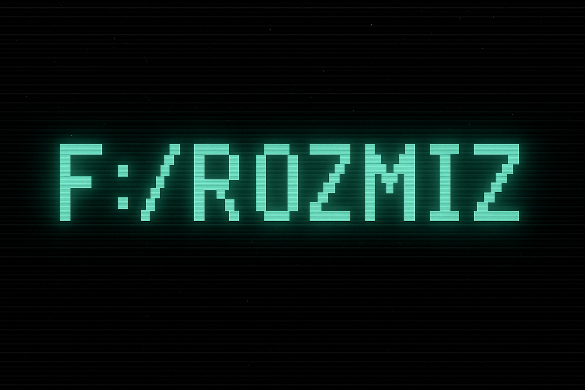

  

<h1 align="center">👾 Frozmiz — Full‑Stack Developer & AI Enthusiast</h1>

  Exploring the intersection of web development, artificial intelligence, and creativity.

  
  

---

## 🚀 About Me

- 💻 Full‑Stack Developer obsesionado con **interfaces limpias**, **rendimiento** y **DX**.
- 🧠 Cursando **doble máster en ConquerBlocks**:
  - **Full Stack Dev** → React/Next.js, Tailwind, Node/Express, SQL, Supabase, API design.
  - **AI** → Machine Learning aplicado a proyectos reales.
- 🌱 Siempre creando cosas útiles y enseñando lo aprendido por el camino.

---

## 📌 Featured Projects

### 🧭 Slowork — Landing Page
Anuncio de visión y comunidad para conectar *remote workers* con viajes con propósito.
  
**Highlights**
- 🎥 Background video suave • 🌓 Dark mode
- 🌐 i18next + routing SEO‑friendly • 🖼️ Cloudinary
- 📝 Blog dinámico con creación “admin‑only”
- 🔐 Panel admin (localStorage‑based)

**Stack** → **React** · **Supabase** · **TailwindCSS** · **Vercel** · **Cloudinary** · **i18next**

---

### 🧘‍♂️ breathe‑app · <a href="https://github.com/Frozmiz/breathe-app">repo</a>
Mapa mindful que localiza parques cercanos con geolocalización y OpenStreetMap.

**Features**
- 🔭 Lazy‑load de parques por *viewport*
- 🪄 Overlay animado con mensajes inspiracionales
- 🗺️ Compatibilidad OSM: `node` | `way` | `relation`
- 🎯 UI elegante con Tailwind y botón *recenter*

**Stack** → `React`, `Leaflet`, `Overpass API`, `TailwindCSS`

---

### 🚧 Slowork Web Platform (WIP)
Plataforma escalable para nómadas digitales y *remote workers*.

**Stack previsto**
- ⚛️ **Angular** • 🎨 **TailwindCSS** • 🧱 **Material UI**
- 🔗 **GraphQL** + **Apollo Client**
- 🧵 **PostCSS** + **Babel**

---

## 🛠️ Tech & Tools

  
  
  
  
  
  
  
  
  
  
  
  

- **Frontend**: React, Next.js, Tailwind
- **Backend**: Node.js, Python, Supabase
- **DB**: MySQL
- **Deploy**: Vercel
- **AI**: Claude, flujos en Python
- **Aprendiendo**: ML/AI aplicada

---

## 📚 Education

**👨‍💻 Full‑Stack Master @ ConquerBlocks**  
**🧠 AI Master @ ConquerBlocks**

---

## 📊 GitHub Stats

  <picture>
    <source srcset="https://github-readme-stats.vercel.app/api?username=Frozmiz&show_icons=true&theme=tokyonight" media="(prefers-color-scheme: dark)">
    
  </picture>

  <picture>
    <source srcset="https://github-readme-stats.vercel.app/api/top-langs/?username=Frozmiz&layout=compact&theme=tokyonight" media="(prefers-color-scheme: dark)">
    
  </picture>

---

## 📫 Contact

- **Email** → <a href="mailto:frozmiz@live.com">frozmiz@live.com</a>  
- **GitHub** → <a href="https://github.com/Frozmiz">@Frozmiz</a>

  Thanks for visiting my profile 🚀 See you in the code! ❤️

